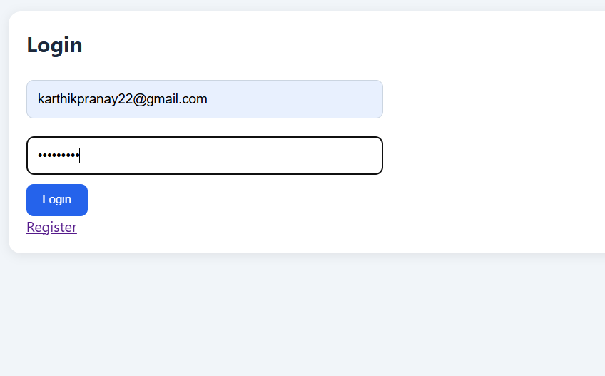
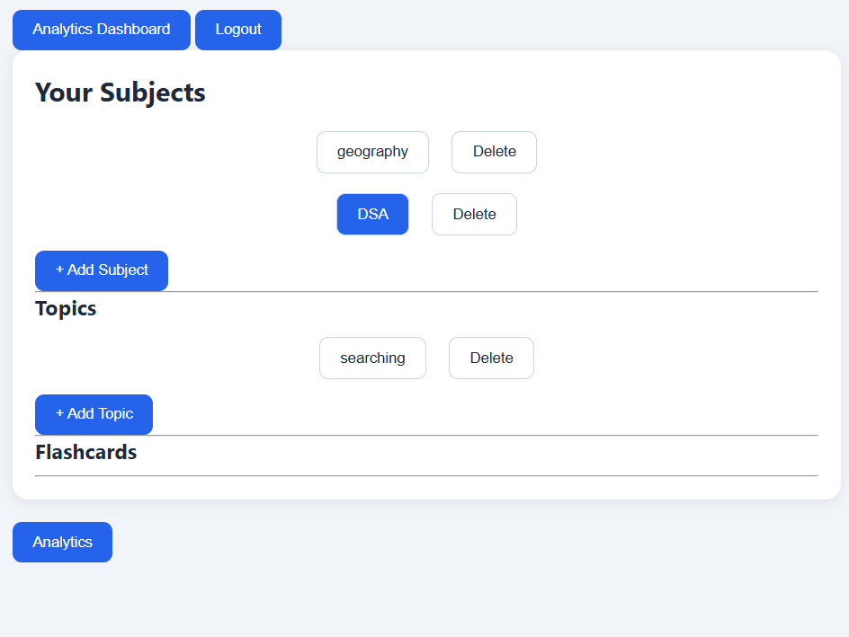
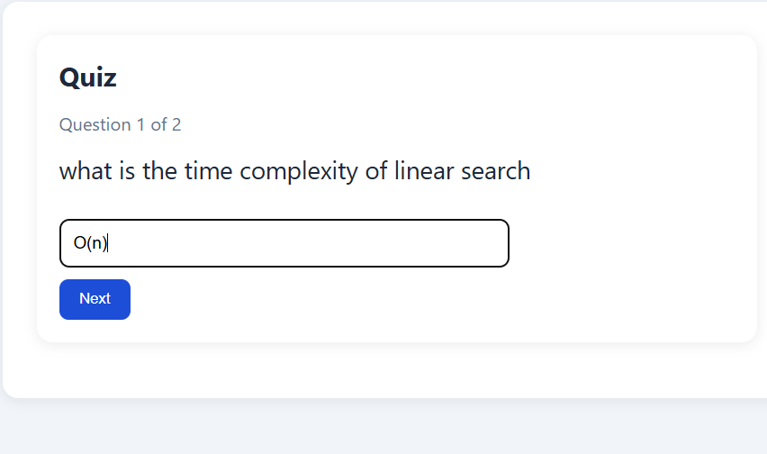
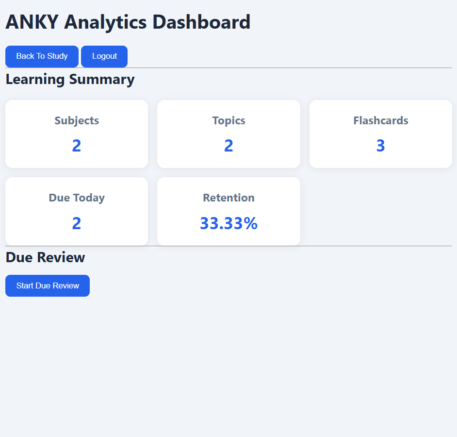
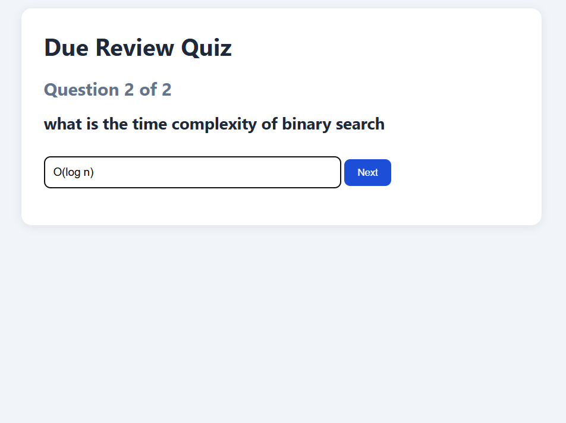

# ANKY - Smart Flashcard Learning Platform

## Overview

ANKY is a flashcard-based learning platform designed to help users improve long-term memory retention through active recall and spaced repetition techniques.

The application allows users to organize knowledge into Subjects, Topics, and Flashcards, practice through quizzes, and automatically schedule future reviews based on performance.

The project is built using Flask, MySQL, HTML, CSS, and JavaScript, with JWT-based authentication for secure access.

---

## Features

### User Authentication

* User Registration
* User Login
* JWT Authentication
* Protected Routes
* Logout Functionality

### Knowledge Management

* Create Subjects
* Delete Subjects
* Create Topics under Subjects
* Delete Topics
* Create Flashcards under Topics
* Delete Flashcards

### Quiz System

* Topic-wise Quiz Generation
* Randomized Questions
* Score Calculation
* Immediate Evaluation

### Spaced Repetition

* Tracks Correct Attempts
* Tracks Total Attempts
* Calculates Retention Score
* Automatically Updates Review Intervals
* Schedules Future Review Dates

### Analytics Dashboard

* Total Subjects
* Total Topics
* Total Flashcards
* Due Flashcards Count
* Average Retention Percentage

### Due Review System

* Review only flashcards that are due
* Dedicated Due Review Quiz
* Performance Tracking
* Answer Review after Quiz Submission

---

## Project Workflow

User Registration/Login

↓

Create Subjects

↓

Create Topics

↓

Create Flashcards

↓

Attempt Topic Quizzes

↓

System Calculates Retention Score

↓

Next Review Date is Scheduled

↓

Analytics Dashboard Tracks Progress

↓

Attempt Due Review Quiz

↓

Improve Long-Term Retention

---

## Tech Stack

### Backend

* Python
* Flask
* Flask-JWT-Extended

### Database

* MySQL

### Frontend

* HTML
* CSS
* JavaScript

### Authentication

* JWT (JSON Web Tokens)

---

## Database Schema

The project uses the following entities:

### Users

Stores user account information.

### Subjects

Stores subjects created by users.

### Topics

Stores topics belonging to a subject.

### Flashcards

Stores:

* Question
* Answer
* Review Information
* Retention Metrics
* Scheduling Information

---

## Application Screenshots

### Login Page



### Dashboard



### Quiz



### Analytics Dashboard



### Due Review System



---

## Installation

### 1. Clone Repository

```bash
git clone <repository-url>
```

### 2. Install Dependencies

```bash
pip install -r requirements.txt
```

### 3. Create MySQL Database

```sql
CREATE DATABASE anky_db;
```

### 4. Run Database Schema

Execute the SQL statements available in:

```text
schema.sql
```

### 5. Configure Environment Variables

Create a `.env` file using `.env.example`.

Example:

```env
MYSQL_HOST=localhost
MYSQL_USER=root
MYSQL_PASSWORD=your_password
MYSQL_DB=anky_db

```

### 6. Start Application

```bash
python app.py
```

---


## Learning Outcomes

Through this project, I gained practical experience in:

* REST API Development
* JWT Authentication
* Database Design
* CRUD Operations
* Frontend-Backend Integration
* Spaced Repetition Algorithms
* User Progress Tracking
* Full Stack Application Development

---

## Author

Ravada Sandeep

GitHub: https://github.com/Ravada-Sandeep

LinkedIn: https://www.linkedin.com/in/sandeepravada/
